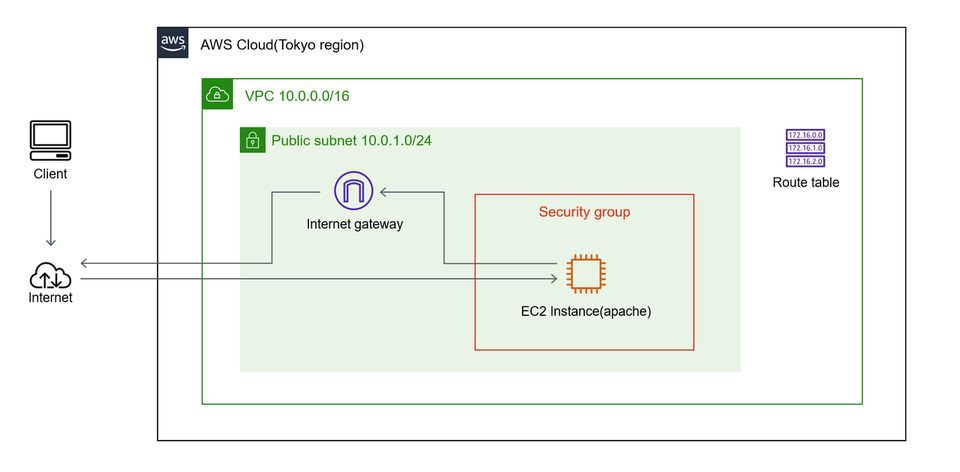

# Learn Terraform with AWS

詳しい説明は以下の記事を参照．

https://blog.chellwo.com/about-terraform

## 前提

Terraform（v1.3.5） と AWS CLI（v2.9.1） はインストール済みとする．

## 構成図

以下を構成する．



## リソース作成

以下のコマンドを実行していけばリソースが作成される．

```
terraform init
terraform plan
terraform apply
```
